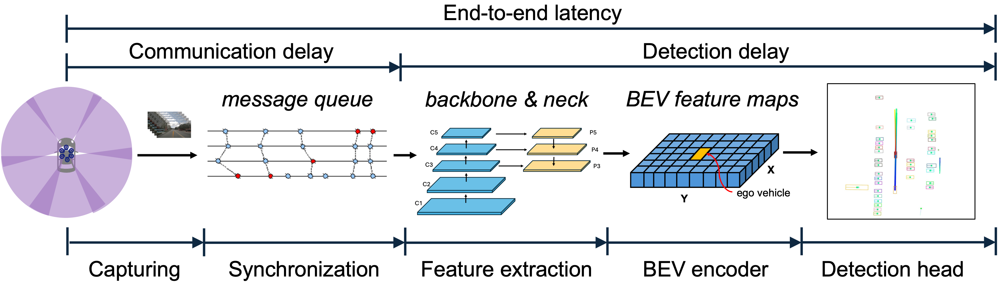
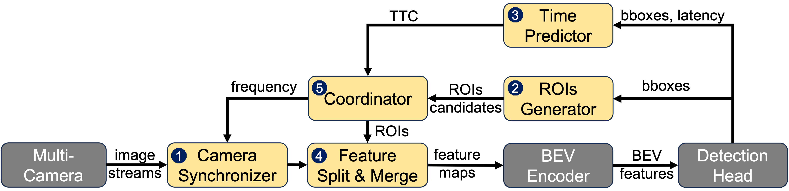

# RT-BEV: Real-Time BEV Perception for AVs

## Overview

**RT-BEV** is an innovative framework designed to provide real-time, vision-centric **Bird's Eye View (BEV)** perception for autonomous vehicles (AVs). BEV perception is essential for improving situational awareness, navigation, and decision-making by offering a 360-degree view of the environment using multi-camera systems. RT-BEV addresses the challenges of computational overhead in real-time BEV perception through a dynamically optimized pipeline that focuses on critical areas of interest.

RT-BEV enhances real-time performance by co-optimizing message communication and detection. It utilizes dynamic Regions of Interest (ROIs) tailored to the driving environment, reducing unnecessary processing and improving accuracy, while minimizing overall end-to-end (e2e) latency.

### Key Features:
- **ROI-Aware Perception**: Dynamically adapts ROIs based on traffic environments and driving contexts, focusing computational power on the most critical areas.
- **ROI-Aware Communication & Synchronization**: Advanced camera synchronization ensures real-time multi-camera input processing.
- **Real-time BEV Perception**: Achieves low-latency BEV generation while maintaining high accuracy.
- **Seamless ROS Integration**: Synchronizes multi-camera input, publishes image data, and interfaces with real-time applications.

### End-to-End BEV Perception Pipeline

The following figure illustrates the end-to-end BEV perception pipeline used in RT-BEV:



## System Design

RT-BEV’s modular design optimizes real-time data processing and synchronization to meet the challenges of autonomous driving. The core components include:

1. **Camera Synchronizer**: Synchronizes input from multiple cameras using an ROI-aware policy, reducing synchronization delays and focusing processing on important areas of the scene.
2. **ROIs Generator**: Dynamically generates context-aware ROIs based on the driving environment, minimizing the computational load by focusing only on the most important regions.
3. **Feature Split & Merge**: Processes ROIs with high accuracy while using temporal locality for non-critical regions, merging the processed feature maps for complete scene understanding.
4. **Time Predictor**: Forecasts processing time for ROIs and adjusts priorities in real time based on time-to-collision (TTC) predictions, ensuring critical areas are prioritized.
5. **Coordinator**: Manages synchronization strategies, keyframe frequency, and computational resources, balancing real-time performance and detection accuracy.

The design architecture is shown in the following figure:



By focusing computational resources on dynamic ROIs, RT-BEV significantly reduces latency while maintaining high accuracy in BEV perception, critical for real-time decision-making in autonomous driving scenarios.

## Implementation

The RT-BEV system is implemented in **Python** using **PyTorch** for deep learning and **ROS** for real-time data processing and synchronization. Key implementation components include:

- **Torch Inference**: PyTorch models process multi-camera images to generate BEV representations.
- **ROS Integration**: ROS nodes manage real-time camera synchronization, image publishing, and BEV processing to provide seamless communication across modules.

## Installation and Setup

To set up the environment, prepare datasets, and run the system, please refer to the following guides:

- [Installation Guide](./doc/install.md)
- [Dataset Preparation Guide](./doc/dataset.md)
- [Running RT-BEV](./doc/run.md)

The **nuScenes V1.0 mini** dataset is already included in the Docker container, so no additional setup is required for initial testing.

### Installation Overview

Follow the steps in the [Installation Guide](./doc/install.md) to install the required dependencies. This guide walks you through setting up the environment using either a Docker container or a non-Docker approach.

## Usage Instructions

### For Docker Users:

1. **Step 1**: Open four terminals connected to the Docker container:
   ```bash
   docker exec -it container_name bash
   ```

2. **Step 2**: In Terminal 1, run the ROS master node:
   ```bash
   roscore
   ```

3. **Step 3**: In Terminal 2, run the RT-BEV inference node:
   ```bash
   cd UniAD
   ./tool/test_inference.sh
   ```

4. **Step 4**: In Terminal 3, run the multi-camera synchronization node:
   ```bash
   source /home/mobilitylab/catkin_ws/devel/setup.bash
   roslaunch rtbev_message_filters synchronizer.launch
   ```

5. **Step 5**: In Terminal 4, publish camera images:
   ```bash
   source /home/mobilitylab/catkin_ws/devel/setup.bash
   rosrun video_stream_opencv ros_publish_multi_cameras.py
   ```

For more detailed instructions, refer to the [Running RT-BEV](./doc/run.md) guide.

## Results

RT-BEV has been evaluated on the **nuScenes V1.0** dataset, achieving the following:

- **Accurate BEV representations** with reduced computational latency.
- **Efficient multi-camera synchronization**, ensuring smooth and real-time image processing.
- Robust handling of complex driving scenarios, even in dense environments with multiple dynamic and static objects.

## Citation

If you use this work, please cite it as follows:

```
@inproceedings{liu2024bev,
  title = {RT-BEV: Enhancing Real-Time BEV Perception for Autonomous Vehicles},
  author = {Liu, Liangkai and Lee, Jinkyu and Shin, Kang G.},
  booktitle = {45th IEEE Real-Time Systems Symposium},
  year = {2024.}
}
```
